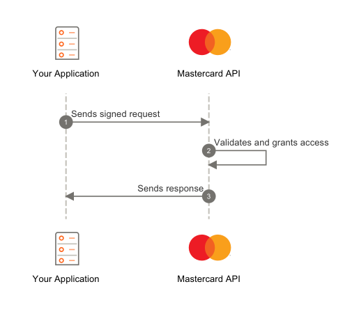

# Kazakhstan (Travel App)
A travel companion app that converts currencies and translates essential words and sentences from English to Russian.

<table>
<tr>
<td>Light Appearance</td>
<td>Dark Appearance</td>
</tr>
<tr>
<td></td>
<td></td>
</tr>
</table>

## Features

- Get the latest exchange rate using the [Mastercard Enhanced Currency Conversion Calculator API](https://developer.mastercard.com/enhanced-currency-conversion-calculator/documentation/api-reference/).
- Use Podfile to digitally sign and authorize requests made to the API using [MastercardOAuth1Signer](https://github.com/Mastercard/oauth1-signer-swift).
- Save and retrieve the exchange rate locally using UserDefaults to avoid expensive roaming costs abroad.
- Made for iOS using SwiftUI.

## How-To
- A [Mastercard Developer account](https://developer.mastercard.com/product/currency-conversion-calculator/) is required to create a project and generate a certificate and consumer key. For more information, look at the [Mastercard Quick Start Guide](https://developer.mastercard.com/platform/documentation/getting-started-with-mastercard-apis/quick-start-guide/).

1) Import your MasterCard API's `.p12` certificate in the Xcode project and edit the `certificateName` constant in `CurrencyViewModel.swift`.
2) Edit the `keystorePassword` constant in `CurrencyViewModel.swift`.
3) Edit the `consumerKey` constant in `CurrencyViewModel.swift`.
